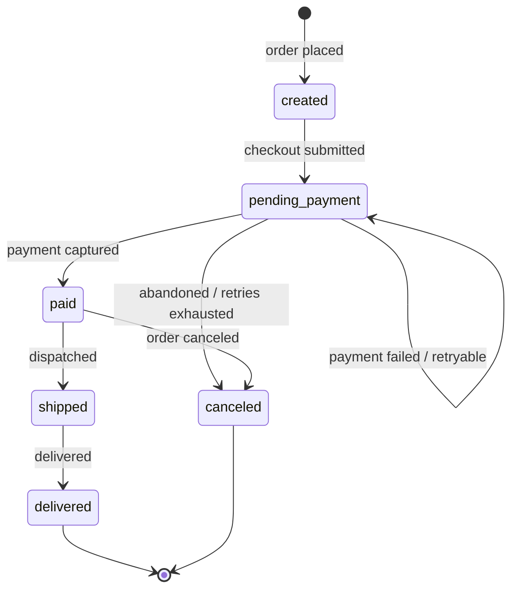

# Modelling the order lifecycle

Your `status` string is being asked three different questions at once, and that's why the frontend keeps special-casing `payment_failed`. Pull the three questions apart and each gets a cleaner home:

- **What just happened?** → an **event** (past-tense verb on the webhook envelope): `order.payment_failed`
- **Where is the order now?** → the **status** (one persistent value, driven by a state machine): `order.pending.payment`
- **Why, and what should the user do?** → an **issue** (a structured annotation carried alongside the order), with a code, severity, message, and links: `payment.declined.insufficient_funds`

The core mistake today is that `payment_failed` is a *status* value that's actually encoding *what happened* and *why*. It's a status doing an event's and an issue's job. Once you separate them, the frontend's special-casing largely disappears, because the status alone tells it what to render and the issue tells it whether a retry is possible.

## Start with the state machine

Draw it before naming anything. Nodes are states, edges are transitions.



The thing the picture forces into the open: **a failed payment is not a state, it's a self-loop on `pending_payment`**. The order sits in the same place whether it's the first attempt or the fourth — failure loops back, it isn't a terminal node. That's the single most important change from your current model.

## The states

Drop `payment_failed` as a status entirely. Here's the proposed status set, written as parseable dot-separated strings — `{domain}.{state}.{substate}`:

| Status | Meaning | What the frontend does |
|---|---|---|
| `order.created` | placed, not yet submitted for payment | show summary, "pay now" |
| `order.pending.payment` | awaiting a successful payment | show payment form; if there's an active issue, show the decline reason + retry |
| `order.paid` | payment captured, not yet shipped | "preparing your order" |
| `order.shipped` | dispatched | tracking info |
| `order.delivered` | delivered (terminal) | done |
| `order.canceled` | terminal, no further action | "order canceled" |

Notes:

- **Name states by what's needed next, not by where they sit in the lifecycle.** `pending.payment` tells the consumer *a payment is owed* — far more useful than a bare `pending`. The substate (`payment`) is genuine substructure: a `pending` order could later also be `pending.fulfillment`, with different transitions.
- **`created` vs `pending.payment`** are only worth keeping separate if "placed but not yet attempting payment" is a real, distinct state for you. If checkout always immediately attempts payment, collapse them — the diagram is where you decide this. Don't keep a state that no transition distinguishes.
- **Failure is not terminal.** There's no `payment_failed` status, and no `failed` status at all. A declined card returns to `order.pending.payment`. The only terminal states are `delivered` and `canceled` (the latter covers retries exhausted, fraud, or an explicit cancel).
- **Use US spelling on the wire**: `canceled`, not `cancelled`. Status codes are part of the contract, and US spelling is the HTTP lingua franca — keep it consistent with everything else machine-readable.

## The events

Events are past-tense verbs, namespaced to the domain, fired on the webhook envelope. They record a transition that *completed*:

- `order.created`
- `order.payment_failed` ← the decline, as an **event**
- `order.paid`
- `order.shipped`
- `order.delivered`
- `order.canceled`

`order.payment_failed` is exactly where "payment failed" belongs — it's a thing that *happened*. Note it does **not** have a matching status. That asymmetry is correct and is the whole point: a failed-payment event leaves the order in `order.pending.payment`, not in some `payment_failed` resting place.

(If a status name and an event name ever collide — e.g. a `paid` event landing you in a `paid` status — that's fine here because they live in different fields and namespaces: `event.type` vs `order.status`. The collision is only a warning sign when it means the state is just "the last event echoed back." `pending.payment` after a `payment_failed` event is genuinely a different word from the transition, which is the signal the model is well-formed.)

## The issue: where "can they retry?" lives

This is what kills the frontend's special-casing. When a payment fails, send an issue alongside the order:

```json
{
  "status": "order.pending.payment",
  "issues": [
    {
      "issue": "payment.declined.insufficient_funds",
      "severity": "error",
      "correlationId": "4b3a2c1d-0000-0000-0000-abcdef123456",
      "dateTime": "2026-06-04T12:34:56Z",
      "message": {
        "title": "Payment declined",
        "detail": "Your card was declined for insufficient funds. Please try a different card."
      },
      "links": {
        "documentation": "https://docs.example.com/errors/declined",
        "api": "https://api.example.com/orders/123/payment"
      }
    }
  ]
}
```

The frontend logic becomes:

- **What to show** → read the `status` (`order.pending.payment` means "show the payment step"). One branch, no `payment_failed` special case.
- **Whether they can try again** → is there an active `payment.declined.*` issue with a retry link present? The retry link is included while retries remain and **omitted once they don't** — so "can they retry?" is just "is the retry link there?", not a state the frontend has to infer.
- **What copy to show, including different copy on a second attempt** → `issue.message`, plus the presence of an earlier `order.payment_failed` in history. You don't need a `pending.new_card` state or a `last_decline_reason` field — it's the same `issues` structure you use everywhere else.

Crucially, the *reason* (`insufficient_funds`, `expired_card`, `do_not_honor`) never enters the status. The status stays honest about *location*; the issue carries *cause and remedy*. If you later pass through a processor's raw code, put it in the issue's `thirdParty` object — never build retry logic on it; branch on your own `issue` code.

## Why this is better than what you have

- The frontend reads **one** field (`status`) to decide what screen to render, and checks for a retry **link** to decide whether retry is offered — no reverse-engineering `payment_failed`.
- Retries no longer need a new status per attempt. Attempt 1 and attempt 4 are the same `order.pending.payment`.
- The decline reason has a consistent home (`issues`) shared with every other error in your API, surfaceable to the end user via `message`, and traceable via `correlationId`.
- Webhook consumers get a clean past-tense event stream (`order.payment_failed`, `order.paid`, …) that's distinct from the resource's current condition.

## Two things to decide deliberately

1. **Enum vs parseable string.** The dot-separated strings above let consumers `split('.')` and match on prefixes (`order.pending` ignoring the substate). That degrades gracefully as you add substates, but the *grammar* becomes the contract — so document the discipline: match on prefixes, treat unknown deeper segments as "more specific than I handle," never assume a fixed depth. Answer this **once** for both `status` and `issue` codes — don't ship one as a strict enum and the other as a forgiving string. Early on, keep both as strings since the taxonomy will grow.

2. **The `active` boundary on issues.** A decline is clean: it happened, it's over, the status holds the condition that persists (`pending.payment`), and the issue is a transient annotation. You don't need `active` here — omit it rather than ship a stale `active: true`. Only reach for `active` if you later have a genuinely ongoing, resolution-tracked condition, and if you do, that's usually a sign it deserves its own status rather than a boolean hiding inside an issue.
