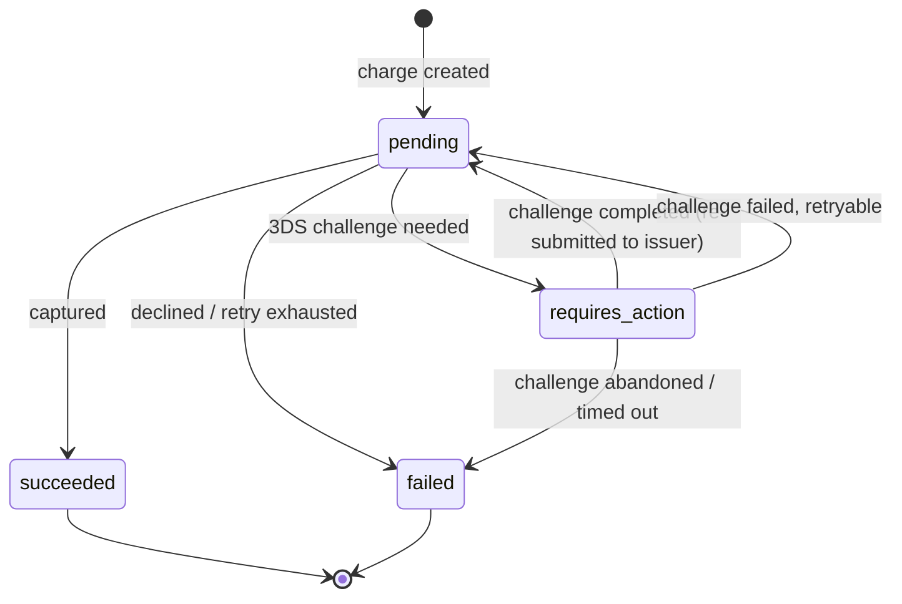

# Modelling the 3DS-pause state

Your instinct to add `requires_action` is right, and it's right for the reason Stripe got right: a status should be named for **what the consumer has to do next**, not for where it sits in the lifecycle. `pending` only says "wait." `requires_action` says "you, the integrator, have a job to do" — surface the challenge. That's a status doing real work.

But before you add it, the more important move is to split apart the three different questions your single `status` enum is quietly being asked to answer. 3DS is the case that makes the seams obvious, because the frontend needs three distinct things: it needs to *know it should pop a challenge* (a state), it needs *the data to render it* (the challenge URL / parameters), and it ideally has *a record of what just happened* (an event, for webhook consumers). Cramming all of that onto a flat `requires_action` enum value is how you end up bolting on side fields later.

## The three carriers

Pull the one overloaded `status` field into three:

- **Status** — *where is the charge now?* One persistent value, driven by your state machine. This is where `requires_action` lives.
- **Event** — *what just happened?* A past-tense verb on the webhook envelope, e.g. `charge.action_required`. This is how a backend learns the charge paused without polling.
- **Issue** — *why, and what to do?* The structured annotation that carries the challenge details, a human message, and links. This is how the frontend gets the URL it needs to pop the challenge.

The key insight: **the frontend should not get the challenge URL out of the status string.** The status tells it *that* action is required; an accompanying `issues` entry (or a dedicated `next_action` object, depending on which you prefer — see below) carries the *what*.

## The state machine

Draw it before naming anything. 3DS adds a branch out of `pending`:



Two things the picture forces into the open:

1. **`requires_action` is not terminal and not a sibling of `failed`.** It's a detour off the happy path. When the cardholder completes the challenge, the charge flows *back* toward `pending`/`succeeded`. Your current `failed | succeeded` framing treats every off-ramp as an exit; this one is a loop.
2. **A failed or abandoned challenge is also recoverable in most cases.** A timeout or a "try again" from the issuer should return to `pending` (or `requires_action` again), not jump straight to terminal `failed`. Reserve `failed` for the genuinely dead end — retries exhausted, hard decline.

## Use a parseable string, not a flat enum

You currently have a flat enum (`pending`, `succeeded`, `failed`). The moment you add `requires_action` you'll want substructure — and 3DS is exactly where it shows up, because "awaiting a payment method," "awaiting 3DS," and "awaiting capture" are all kinds of pending with different transitions. Move to a dot-separated, prefix-parseable string:

```json
{ "status": "charge.requires_action.three_d_secure" }
```

- `charge` — the domain. Feels redundant in a single endpoint, but it stops being redundant the instant these statuses flow through an aggregated webhook stream alongside refunds, payouts, disputes.
- `requires_action` — the state. What the consumer branches on.
- `three_d_secure` — the substate. *Which* action, so a frontend that handles several action types (3DS today, micro-deposit verification tomorrow) can dispatch on it.

Document the parsing discipline so this doesn't become a fragile implicit contract: consumers match on prefixes (`charge.requires_action.*`), treat any segment they don't recognise as "more specific than I handle," and never assume a fixed depth. That way adding a new action substate later doesn't break prefix matchers.

Whatever you decide — strict enum vs parseable string — decide it **once** and apply it to both `status` and your `issue` codes. They share one grammar (`{domain}.{primary}.{detail}`); shipping one as a strict enum and the other as a forgiving string is a seam with nothing behind it.

## Telling the frontend to show the challenge

The status tells the frontend *to* act. The challenge data has to come alongside, not be encoded into the status. Two reasonable homes for it:

**Option A — carry it as an `issue`** (consistent with how you'd surface declines and everything else):

```json
{
  "id": "charge_123",
  "status": "charge.requires_action.three_d_secure",
  "issues": [
    {
      "issue": "payment.action_required.three_d_secure",
      "severity": "info",
      "correlationId": "4b3a2c1d-0000-0000-0000-abcdef123456",
      "dateTime": "2026-06-04T12:34:56Z",
      "active": true,
      "message": {
        "title": "Extra verification needed",
        "detail": "Your bank needs to confirm this payment. You'll be asked to complete a quick security check."
      },
      "links": {
        "documentation": "https://docs.example.com/charges/3ds",
        "api": "https://acs.issuer.example.com/challenge?token=..."
      }
    }
  ]
}
```

Here `severity: "info"` is honest — the request didn't fail, it's paused awaiting the cardholder. The challenge redirect/init URL rides in `links.api`. The `message` is integrator-overridable copy they can show the end user.

**Option B — a dedicated `next_action` object** (closer to Stripe's `next_action`, cleaner if the challenge needs structured parameters rather than a single URL):

```json
{
  "id": "charge_123",
  "status": "charge.requires_action.three_d_secure",
  "next_action": {
    "type": "three_d_secure_redirect",
    "redirect_url": "https://acs.issuer.example.com/challenge?token=...",
    "return_url": "https://merchant.example.com/checkout/return"
  }
}
```

Pick A if you want one consistent annotation shape across declines, warnings, and pauses (fewer surfaces for the frontend to learn). Pick B if 3DS challenges carry enough structured, typed parameters that stuffing them into an issue's `links` feels lossy. Either way, the principle holds: **the status announces the obligation; a sibling structure carries the payload.** Don't make the frontend reconstruct the challenge from a string.

## The webhook event

For consumers who learn about the pause server-side, emit a past-tense event on the webhook envelope:

```json
{
  "event": "charge.action_required",
  "data": { "id": "charge_123", "status": "charge.requires_action.three_d_secure", "...": "..." }
}
```

Keep the event vocabulary distinct from the state vocabulary, and in a different field — `event` records the transition (`charge.action_required`), `status` records the condition (`charge.requires_action.three_d_secure`). When the cardholder finishes, you'll emit `charge.succeeded` or `charge.declined` as normal, and the status moves on.

## One caveat to flag

That `active: true` in Option A is doing something subtle and worth being deliberate about. While the charge is paused, the 3DS condition is genuinely *ongoing and resolution-tracked* — which is exactly the case where an issue's `active` flag starts behaving like a second state machine hiding in a boolean. You already have a status field that owns "this charge is awaiting action" (`requires_action`). So treat the `issue`/`next_action` as **the notification that the status is paused**, and let the *status* remain the authoritative answer to "is this still waiting?" Don't let the frontend poll `active` and the status field and risk them disagreeing. The status is the source of truth for the condition; the issue carries the cause, the copy, and the URL.

## Summary

- Yes to `requires_action` — it names the obligation, which is the whole point.
- Make it `charge.requires_action.three_d_secure` (domain.state.substate, prefix-parseable), not a flat enum value, so it survives aggregated channels and gains substructure cleanly.
- Treat `requires_action` as a **non-terminal detour**, not a sibling of `failed`. The charge loops back toward `succeeded` once the challenge completes; only exhausted retries / hard declines are terminal.
- The status says *act*; carry the challenge URL/parameters in a **sibling structure** (an `issues` entry or a `next_action` object), never baked into the status string.
- Emit a past-tense webhook event (`charge.action_required`) for backend consumers, kept in a separate field/namespace from the status.
- Decide enum-vs-string **once** and apply it to both status and issue codes — they share one grammar.
