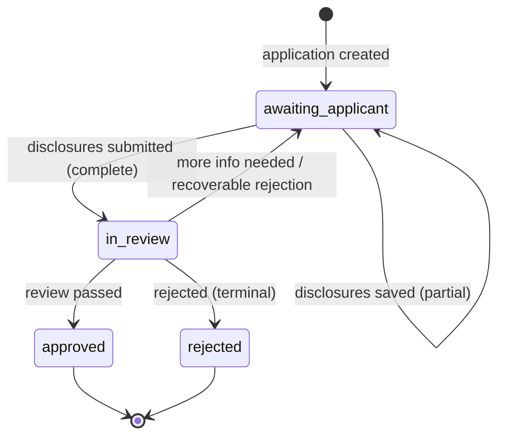

# Modelling a KYB status field

Short version: the structure you've sketched will work mechanically, but it bakes in two problems that will bite your ops team specifically. `kyb.review.approved` and `kyb.review.rejected` overload the status with an *outcome* (a thing that happened), and — more importantly for your stated goal — your status names tell you *what stage* the application is in but not *whose court the ball is in*, which is the one question your dashboard exists to answer. Let me unpack both, then give you a concrete shape.

## First, the question your dashboard actually asks

You said the main job of the dashboard is "waiting on us vs waiting on the customer." That's the design constraint that should drive everything. So before naming anything, ask of each status the only question that matters to its consumer: *given this status, what do I do next?* If your ops tool has to look at a status and then go consult a second field — or worse, reason about it — to decide whether it's actionable for them, the status isn't finished.

"Waiting on us vs waiting on the customer" is fundamentally a question about **who is obligated to act next**. Name your states by the obligation they imply, not by where they sit in the lifecycle. This is the Stripe `requires_action` / `requires_confirmation` lesson: a state name that tells you *who must move next* is doing far more work than one that just marks distance travelled.

## The state machine, before the names

Draw the machine first — nodes are states, edges are transitions. Drawing it surfaces where you've over- or under-specified.

Two things this picture forces into the open:

**1. Your "disclosures: not started / partial / complete" is not three states — it's one state plus progress.** Not-started, partial, and complete all share the same transitions (the applicant can keep editing; submitting moves to review) and, crucially, the same answer to "whose court is it in?" — the applicant's, in all three. So collapse them into a single `awaiting_applicant` state, and carry the not-started/partial/complete granularity as a separate completion field (e.g. a percentage, or a `sections` breakdown). That detail is for a progress bar, not for the state machine. Folding it into the status would triple your state count without changing what anyone *does* next.

**2. Rejection has two edges, not one.** In KYB, a lot of "rejections" are really "we need a clearer document / a missing UBO / a better proof of address" — recoverable, and the ball goes back to the applicant. A genuinely terminal rejection (sanctions hit, fraud, ineligible business type) is a different edge. Treat failure as usually-not-terminal: the recoverable case loops back to `awaiting_applicant`, and only the truly dead-end case goes to a terminal `rejected`. If you model rejection as a single terminal state you'll discard the path back, and your ops team will end up working around the status instead of with it.

## The naming problem: `approved` / `rejected` are outcomes, not locations

Here's the core issue with `kyb.review.approved` and `kyb.review.rejected`. A status answers *where is the resource now?* An approval or a rejection is *what just happened* — a transition, an event. You're recording the last event in the field that's meant to tell you the current location.

The tell is that "approved" and "rejected" are past-tense outcomes hanging off `review`, but the resource is no longer *in review* once either has happened. So the nesting is slightly fictional: `kyb.review.approved` reads as "in review, in the approved sub-stage," when what you mean is "review is over, result was approval."

Pull the three questions apart — they have three different homes:

- **What just happened?** → an **event** (past-tense verb, on the webhook envelope): `kyb.approved`, `kyb.rejected`, `kyb.submitted`, `kyb.info_requested`.
- **Where is the resource now?** → the **status** (one persistent value, the state machine): `kyb.awaiting_applicant`, `kyb.in_review`, `kyb.approved`, `kyb.rejected`.
- **Why, and what should I do about it?** → an **issue** (a structured annotation with a namespaced code, severity, message, and links): e.g. `kyb.rejected.sanctions_match` or `kyb.info_requested.proof_of_address_unclear`.

Note that `approved` and `rejected` legitimately appear as *both* events and terminal states — that's fine and expected. The disambiguation is structural: the event lives in `event.type`, the status lives in `object.status`, different fields and different namespaces. What you should *not* do is keep the rejection *reason* in the status. `kyb.rejected.sanctions_match` smuggles a "why" into a "where." The reason belongs in an issue beside the status, using your standard issues array — same structure you use everywhere else, with a message your ops team (and, where appropriate, the applicant) can read, and links to the flagged document or the next action.

## Recommended shape

A status as a dot-separated, prefix-parseable string, `{domain}.{state}.{substate}`:

| Status | Whose court | Meaning |
|---|---|---|
| `kyb.awaiting_applicant` | **Customer** | Application open; applicant is filling in / completing / resubmitting disclosures. Completion % carried separately. |
| `kyb.in_review` | **Us** | Disclosures submitted; ops/automated review in progress. |
| `kyb.approved` | — (terminal) | Approved. Done. |
| `kyb.rejected` | — (terminal) | Terminally rejected (with reason in an issue). |

This gives your dashboard exactly the cut it needs. "Waiting on us" is `kyb.in_review`. "Waiting on the customer" is `kyb.awaiting_applicant`. You can filter on the prefix without consulting anything else — the status answers "what do I do next?" on its own.

If review itself has genuinely distinct internal stages with different transitions — say automated screening, then manual EDD, then a four-eyes sign-off — those are real substates and can nest: `kyb.in_review.screening`, `kyb.in_review.manual`, `kyb.in_review.approval`. Only add them if they have *different transitions* or change who acts; if they're just labels on the same "waiting on us" condition, leave them out and let an issue or a separate field carry the detail. Be careful what you let into the substate: it's for *where* the review is, never *why* something was flagged. The moment a substate starts absorbing flag reasons, it's quietly becoming an error field — that's an issue's job.

## One more granularity decision to make deliberately

"Waiting on us vs the customer" is binary, but real KYB ops boards often want a third bucket: **waiting on a third party** (a credit bureau, a sanctions provider, a registry callback). That's still "not the customer's court" but it's not actionable by your ops team either — and if you collapse it into `in_review`, your team will keep picking up applications they can't actually move. If that's a real state for you, model it explicitly (`kyb.in_review.awaiting_third_party`, or a peer state) rather than discovering it later. If it isn't, don't pre-build it.

## On enum vs parseable string

Your KYB state space will almost certainly grow (new review sub-stages, new terminal reasons handled as issues, possibly that third-party bucket). So lean toward the dot-separated **parseable string** rather than a strict enum, and document the parsing discipline for consumers: split on `.`, match on prefixes, treat any deeper segment you don't recognise as "more specific than I handle," and never assume a fixed depth. That keeps adding a substate from becoming a breaking change for everyone who wrote a `switch`. Just be honest that the *grammar* is now the contract — adding a segment still breaks exact-match consumers, so the prefix-matching discipline has to be written down, not assumed.

Whatever you decide here, decide it **once** and apply it to both the status and the issue codes — they share the grammar, so they should share the enum-or-string answer too. Shipping one as a strict enum and the other as a forgiving string is a seam with nothing behind it.

## So, does your proposal work?

- `kyb.review` for in-review → yes, rename to something like `kyb.in_review`, and recognise its real meaning is "waiting on us."
- `kyb.review.approved` / `kyb.review.rejected` → no, drop the `review.` nesting. These are terminal states `kyb.approved` / `kyb.rejected` (and also event names), not sub-stages of review.
- Missing piece → an explicit `kyb.awaiting_applicant` state so the dashboard's core "whose court?" question is answerable from the status alone.
- Disclosure not-started/partial/complete → not status values; a separate completion field.
- Rejection reasons and "needs more info" → issues beside the status, not extra status segments. And make sure recoverable rejection loops back to `awaiting_applicant` rather than dying in a terminal `rejected`.

The throughline: name each state for the obligation it implies, keep *what happened* (event) and *why* (issue) out of the *where* (status), and the dashboard you described falls out for free.
