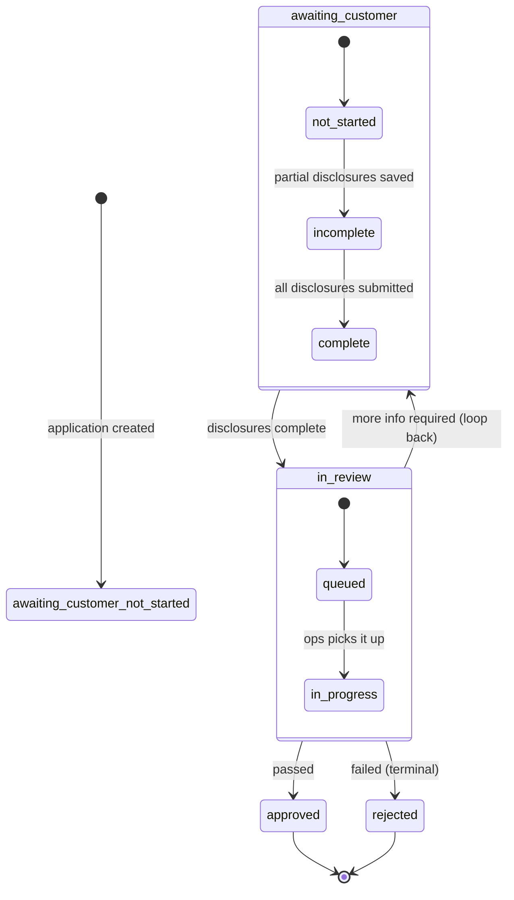

# KYB status modelling

Short answer: the grammar is right, but `kyb.review` as both a value *and* a prefix for its outcomes is a trap — and more importantly, you've picked the wrong thing to put in the middle segment for what your dashboard actually needs. Let me walk through both.

## The bug in `kyb.review` / `kyb.review.approved`

Your instinct to use a dot-separated, parseable status string is good. The problem is a specific one: **a parent segment is either a container or a value, never both.**

You want a bare `kyb.review` to mean "in review," and `kyb.review.approved` / `kyb.review.rejected` for the outcomes. It reads well. But now a consumer that matches the prefix `kyb.review` (the obvious, cheap thing to do — `status.startsWith("kyb.review")`) can't tell apart:

- still in review (the bare value), and
- review concluded, approved (`kyb.review.approved`).

Both fall under the same prefix match. The prefix has stopped discriminating the one thing your ops team most needs to know: *is this still on our desk, or is it done?* And prefixes not lying is the whole reason to prefer a dotted string over an opaque code in the first place.

It's worst precisely because the children here are *terminal*. If the children were all sub-conditions of being in review — `kyb.review.escalated`, `kyb.review.awaiting_committee` — a bare `kyb.review` parent would at least be honest, because they're all kinds of "in review." It's the children that mean review is *over* (`approved`, `rejected`) that turn the bare parent into a false signal.

Fix: give the in-progress state its own leaf so the parent is a pure container.

```
kyb.review.in_progress
kyb.review.approved
kyb.review.rejected
```

Now `startsWith("kyb.review")` means "this application is in our review pipeline (whatever stage)," and the leaf tells you which. No ambiguity.

## The bigger question: what goes in the middle segment?

Here's the more consequential point. A status is three segments — `{domain}.{middle}.{leaf}` — and the middle segment is **an axis, not a fixed slot.** It's the dimension you've chosen to group by, and it's the cheap thing consumers branch on (split on the dot, match the middle, done). So **whatever sits there is the question you've made easiest to answer.**

You've reached for **phase** as the axis — `disclosure`, `review` — which describes *what stage the application is at*. That's a perfectly good axis for a pipeline/progress view. But you told me your dashboard's main job is the opposite question: **which applications are waiting on us vs. waiting on the customer.** That's the **actor** axis — who owns the next move.

With a phase axis, "whose move is it?" is a derived, second-step computation: your dashboard has to know that `kyb.disclosure.incomplete` means *customer's court*, while `kyb.review.in_progress` means *our court*. You can recover the actor from the phase, but it costs a lookup the prefix would have given you for free — and you'll write and maintain that mapping in the dashboard, in any filters, in reporting.

If "whose move is it" is the dominant read, lead with the actor:

```
kyb.awaiting_customer.not_started      # disclosures untouched
kyb.awaiting_customer.incomplete       # disclosures partially done
kyb.in_review.in_progress              # ball's in your court
kyb.approved                           # terminal
kyb.rejected                           # terminal
```

Now your dashboard's headline split is a one-segment match: `kyb.awaiting_customer.*` is the customer's column, `kyb.in_review.*` is yours. The question you most need answered is answered by the prefix alone, with nothing to look up.

Note what this costs: phase is now the derived axis instead of the actor. That's the right trade *if and only if* "whose move" really is your dominant consumer. If you have an equally important pipeline view tracking progress through stages, phase up front is defensible and you accept computing the actor. **Pick the axis your dominant consumer reads most** — you've told me that's the actor, so I'd lead with it. The grammar doesn't change either way; only the question you've made free changes.

(One subtlety with the actor axis: `disclosure.complete` is an interesting boundary — disclosures are done but you haven't started reviewing. Is that "waiting on us"? Almost certainly yes — it's queued for you — so it belongs under `kyb.in_review` with a leaf like `queued` or `not_started`, not under `awaiting_customer`. Drawing the state machine, below, forces this kind of thing into the open.)

## Don't overload the status — split what happened / where it is / why

Your `status` field is quietly being asked three different questions. Pull them apart and each gets a cleaner home:

- **What just happened?** → an **event** (past-tense verb on the webhook envelope): `kyb.disclosures_submitted`, `kyb.review_completed`, `kyb.rejected`. This is what fires the webhook that updates your dashboard.
- **Where is the resource now?** → the **status** (the one persistent value, the state machine): `kyb.in_review.in_progress`. This is what your dashboard reads and groups by.
- **Why, and what should be done?** → an **issue** (the structured annotation): for a rejection, `kyb.review.rejected_sanctions_match` with a severity, a human-readable message your ops team (or the customer) can read, and links to the relevant docs/case.

Concretely, this keeps the **rejection reason out of the status.** `kyb.rejected` is the status (a clean present condition); *why* it was rejected is an issue beside it, not a proliferation of `kyb.review.rejected.sanctions`, `kyb.review.rejected.incomplete_docs`, etc. Reasons multiply forever; keep them out of the state machine. Same consistent issue structure you'd use everywhere else, every surface.

## Watch the naming — present condition, not the next obligation

Two of your phases are fine. But as you flesh this out, resist the tempting trap of naming a state for *what's needed next* — `pending`, `awaiting_documents`, `requires_review`. Those describe a to-do list, not the resource's present condition, and `pending` in particular is close to meaningless (everything live is pending *something*).

- For disclosures the customer is filling in: name what's *missing right now* — `not_started`, `incomplete`, `complete`. Those are present facts and they discriminate. Good.
- For the review you're running: the system/your team is actively working, so the present-progressive is honest — `in_progress`. Good.

Lead with the missing thing or the present condition, never the demand.

## Failure usually isn't terminal — model it as a loop, not a dead end

`approved` and `rejected` are genuinely terminal — they end the line. But think about the *recoverable* failures before you commit. If a customer submits disclosures, you review, and you bounce it back for more information, that's **not** a terminal `rejected` — the application loops back to the customer's court (`kyb.awaiting_customer.incomplete` or a `more_info_required` state). Reserve `rejected` for the genuine dead-end: KYB actually failed and won't proceed. Ask of every failure edge: *is this the end, or a detour back to someone?* Most are detours.

## Draw the machine first

Before you finalise any names, draw the state machine — nodes are states, edges are transitions. It's the fastest way to surface exactly the questions above (where does `disclosure.complete` sit? does review have a "bounce back to customer" edge? what's actually terminal?). Here's a sketch on the **actor axis** with a recoverable-failure loop:



Every node is a present condition (the application *is* awaiting the customer, *is* in review, *is* approved). `in_review` has internal structure (`queued` vs `in_progress`) because those have genuinely different transitions and your team may want to see "sitting in the queue" separately from "being actively worked." The `in_review --> awaiting_customer` edge is the recoverable-failure loop that a `failed | succeeded` model would have thrown away. And the actor axis means your dashboard's core split — `awaiting_customer.*` vs `in_review.*` — is a prefix match.

## Enum or parseable string — decide once

You're clearly leaning parseable string, which is the right call for something whose state space will grow (KYB taxonomies always do). Two things come with that choice:

- **Document the parsing discipline:** consumers match on *prefixes*, treat any deeper segment they don't recognise as "more specific than I handle," and never assume a fixed depth. The moment people parse the string, its grammar (segment count, ordering, meaning of each position) is the contract — an undocumented implicit grammar is more fragile than an enum because nobody agreed to it.
- **Apply the same decision to your issue codes.** Status and issue codes share one grammar — `{domain}.{primary}.{detail}`, broadest to most specific, parsed by prefix. (The middle segment means different things in each: in a status it's the *state/axis*; in an issue it's the *class of problem*. That's the convention, not an inconsistency.) Don't ship the status as a forgiving string and the issue codes as a strict enum, or vice versa — answer the enum-vs-string question once and hold it across both.

## Summary

1. `kyb.review` can't be both a value and a prefix for `approved`/`rejected` — give the in-progress state a leaf (`kyb.review.in_progress`) so the parent is a pure container and prefix matches don't lie.
2. The middle segment is an axis. Your dashboard reads **"whose move is it"**, so lead with the **actor** (`awaiting_customer` / `in_review`), not the phase — it makes your headline split a free prefix match instead of a lookup.
3. Keep three things separate: the **event** (`kyb.review_completed`, fires the webhook), the **status** (one persistent state-machine value), and the **issue** (the rejection reason, severity, message, links). Don't fold the reject reason into the status.
4. Name states for the present condition, never the next obligation (`incomplete`, `in_progress` — not `pending` / `requires_x`).
5. Model recoverable failure as a loop back to the customer; reserve `rejected` for genuine dead ends.
6. Draw the state machine before naming, and make the enum-vs-string call once across both status and issue codes.
