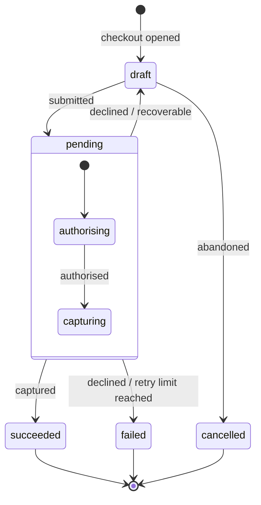

# State and events — modelling and naming a resource's lifecycle

Guidance for designing a `status` field, naming webhook events, and modelling a state machine. Read this when an API needs to communicate *where a resource is* and *how it got there*, not just that something failed.

A `status` field is a contract, and it's where most APIs leak ambiguity — a single word doing the work of three, consumed by people who weren't in the room when you named it. Get it right and an integrator builds correct handling from the payload alone. Get it wrong and they reverse-engineer your intentions from support tickets.

## Contents

- [Status, event, issue: three questions](#status-event-issue-three-questions)
- [Start with the diagram](#start-with-the-diagram)
- [Name states by what's needed next](#name-states-by-whats-needed-next)
- [Failure is usually not terminal](#failure-is-usually-not-terminal)
- [Three things every status should carry](#three-things-every-status-should-carry)
- [Naming: events vs states](#naming-events-vs-states)
- [Enums or parseable strings](#enums-or-parseable-strings)
- [The shared grammar with issue codes](#the-shared-grammar-with-issue-codes)
- [The unresolved boundary: `active`](#the-unresolved-boundary-active)
- [The shape of a good rule](#the-shape-of-a-good-rule)

## Status, event, issue: three questions

A status field gets overloaded because it's asked three questions at once, and they aren't the same question. Pull them apart and each gets a cleaner home:

- *What just happened?* → the **event** — a past-tense verb on the webhook envelope. `purchase.declined`.
- *Where is the resource now?* → the **status** — one persistent value, the state machine. `purchase.pending.payment_method`.
- *Why, and what should I do about it?* → an **issue** — a structured annotation carried alongside the response, with a namespaced code, a severity, a human-readable message, and links to docs, retry, or support. See [error-handling.md](error-handling.md).

The failure case shows why the separation pays. When a card is declined: the event is `purchase.declined`; the status reverts to `purchase.pending.payment_method` — where the purchase now sits, the same value whether it's the first attempt or the fourth; and the reason lives in an issue, `payment.declined.insufficient_funds`, severity `error`, with a retry link while retries remain and none once they don't. The decline reason never enters the status.

A useful consequence: a "show different copy on the second attempt" requirement falls out for free — it's the issue's message, plus the presence of an earlier decline in the history. You don't need a `pending.new_card` state, which would only beg the question of what the third attempt is called. And the *why* never wants a bespoke `last_decline_reason` field; it's the same consistent `issues` structure used everywhere else — one pattern, every surface.

## Start with the diagram

Before naming anything, draw the machine. Nodes are states, edges are transitions; transitions may be conditional, bidirectional, or guarded. Drawing it does two things:

- It shows where you've **over-specified** — states that can be collapsed because nothing distinguishes their transitions.
- It shows where you've **under-specified** — a single state whose edges are doing visibly different jobs, asking to be split.



Note what the picture forces into the open. A decline has *two* edges, not one — back to `draft` when the buyer can try again, out to `failed` only when retries are exhausted. `pending` has internal structure (authorising, then capturing) because those substates have genuinely different transitions. If they didn't, they'd be one state.

## Name states by what's needed next

Name states by the obligation they imply, not by where they sit in a lifecycle. Stripe's `PaymentIntent` uses `requires_payment_method`, `requires_confirmation`, `requires_action` — `requires_action` tells the consumer to *do something* (surface a 3DS challenge), where `pending` only tells them to wait. A state name that implies the next move is doing more work than one that merely marks distance travelled.

This is the question to ask of every status before you commit it to the wire: *given this, what do I do next?* If the status can't answer that on its own, it isn't finished — though sometimes the honest answer is that part of the answer belongs to an event or an issue instead.

## Failure is usually not terminal

A declined card doesn't move to a dead-end `failed` state; it returns to `requires_payment_method` (or `draft`, `pending.payment_method`) so the payment can be retried. Only success and explicit cancellation end the line.

`failed | succeeded` treats failure as a sibling of success — an exit. But most failures are recoverable, and a terminal `failed` discards the path back. Ask of every failure: *is this the end, or a detour?* Usually it's a detour. Reserve genuinely terminal states for the small set of conditions that truly can't continue (retry limit reached, explicit cancellation).

## Three things every status should carry

A well-formed status is three segments in one string — `{domain}.{state}.{substate}` — so `purchase.pending.payment_method` reads as a purchase (domain) that is pending (state), awaiting a payment method (substate). Each segment is broader than the one after it.

- **Domain.** The resource or area the status belongs to. In a single endpoint it's usually implied — but it stops being implied the moment an aggregated webhook consumer fields events from several resource types. Encode it so the status is legible without its envelope. *A status that only makes sense once you know which endpoint delivered it is half a status.*
- **State.** The condition the resource is in: `draft`, `pending`, `succeeded`, `failed`, `cancelled`. This is the part most people mean by "status."
- **Substate.** Genuine substructure within a state. `pending` almost always has it — authorising, awaiting capture, awaiting async settlement — and those may nest further, because each substate has different transitions. **Be careful what you let in here:** the substate is for *where* the resource is, not *why* it got there. A substate that starts absorbing failure reasons is quietly turning into an error field — that belongs in an issue.

## Naming: events vs states

Start with the edges, because verbs are easier to agree on than nouns.

- **Events are past-tense verbs**, namespaced to the domain: `purchase.submitted`, `purchase.authorised`, `purchase.captured`, `purchase.declined`. They record a transition that has completed — the past tense is the point.
- **States are conditions, usually adjectives**: `draft`, `pending`, `failed`, `succeeded`. Don't force everything to `-ed` (`drafted`, `pendinged` is nonsense). The rule that matters isn't a suffix; it's *consistency of category* (pick adjectives or participles and stay there) and *distinctness from the events*.

That distinctness is more than cosmetic. When the natural name for a state is the same word as the event that produced it — the `captured` event lands you in a `captured` state — that collision is a **diagnostic**, not a coincidence. It usually means the state is just "the last event, echoed back": you've recorded *what happened* in the field that's supposed to tell you *where you are*. A well-formed state names the condition the entity is now in, generally a different word from the transition that got it there. If you can't find that different word, the model is probably under-specified.

The disambiguation that always works is structural, not lexical: events and states live in different fields and different namespaces. `event.type` is one thing; `object.status` is another. Even when the vocabulary overlaps, the location resolves it.

## Enums or parseable strings

Decide whether your state space is stable enough to commit to an enum. If you expect to add or split statuses, every addition is a potential breaking change for anyone who wrote an exhaustive `switch` — a real cost, paid by your integrators, not you.

The dot-separated string is the usual middle path:

```json
{ "status": "purchase.pending.payment_method" }
```

The whole string carries a specific meaning, and the consumer can `split('.')` it to act on the parts — branch on the domain, group by state, drill into the substate. It degrades gracefully: code that only cares about `purchase.pending` matches the prefix and ignores what follows.

But be honest about the trade: you haven't removed the breaking-change problem, you've moved it somewhere less visible. The moment consumers parse the string, its *grammar* is the contract — the segment count, the ordering, the meaning of each position. Add a fourth segment and you break exact-match consumers while sparing prefix-match ones. So **document the discipline**: match on prefixes, treat unknown deeper segments as "more specific than I handle," never assume a fixed depth. An implicit grammar nobody documented is more fragile than an enum, precisely because nobody agreed to it.

Reason-as-field versus reason-as-segment is a genuine fork (Stripe keeps the *why* in a sibling `cancellation_reason: fraudulent`). A segment keeps everything legible in one string and survives transport that drops sibling fields; a field is easier to extend and make optional without touching the status contract. Either way, the *why* belongs beside the status, not inside it — and the consistent place for it is an issue.

## The shared grammar with issue codes

The status and the issue code share one grammar: `{domain}.{primary}.{detail}`, read left to right from broadest to most specific, parsed by prefix. The domain plays the same role in each. The middle segment does **not**, and that difference is the convention, not an inconsistency:

| | middle segment | answers |
|---|---|---|
| **status** | the *state* (`pending`) | *where is the resource?* |
| **issue** | the *class* of problem (`unauthorized`) | *why did something go wrong?* |

The shape is shared so the parsing discipline can be too. Both therefore face the same enum-or-string question — answer it **once**. Shipping the issue code as a forgiving string and the status as a strict enum (or the reverse) is a seam with nothing behind it.

## The unresolved boundary: `active`

One field resists the tidy split: an issue's `active` flag — is this still ongoing, or already resolved? For a decline it's clean (it happened, it's over, the status holds whatever condition persists). But the moment an issue is `active`, persistent, and resolution-tracked — a device offline until it reconnects, an authorisation revoked until re-granted — the issue has started asserting a *state*. That's a second state machine hiding in a boolean, free to disagree with the status field that should own the same condition.

The line worth holding: **status is the resource's current condition** — one value, persistent, authoritative. **Issues are annotations on a response** — many, mostly transient, carrying cause and severity and remedy. When an issue wants to be persistently `active`, treat that as a signal the condition deserves a status of its own, and let the issue shrink back to *the notification that the status changed*.

Where exactly that border falls — and whether `active` means "this request was blocked" or "this condition is ongoing," because it can't cleanly mean both — is genuinely open. Flag it rather than answering dogmatically. (See also the `active` field in [error-handling.md](error-handling.md).)

## The shape of a good rule

Name the transition for what happened. Name the state for where you are. Keep the two vocabularies apart, and treat the cases where you can't as a question about your model rather than a quirk of English. Carry the domain even when it feels implied, because one day it won't be. And before you commit a status to the wire, ask the only question that matters to the consumer: *given this, what do I do next?* If the status can't answer alone, that's the sign part of the answer belongs to an event or an issue. Three carriers, three questions — the discipline is keeping each to its own.
